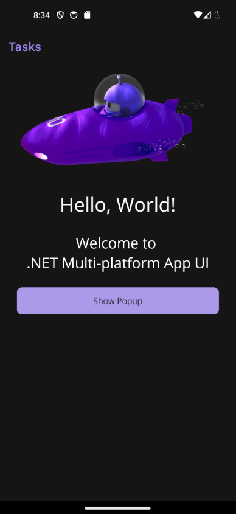
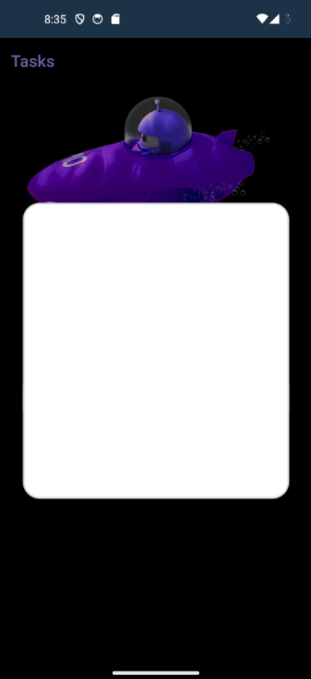

# MauiApp5 - Minimal repro for [Popups don't extend to the Android Status Bar #2952]

The repro contains a woking app that show that the background/overlay of Popups (maui.toolkit) don't extend into the Android Status Bar.
See the next 2 screenshots for the MainPage (in dark mode) and the Popup page.

Note that the color of the StatusBar in the 2nd image is different from the one in the 1st image.
In light mode it is even more obvious.
